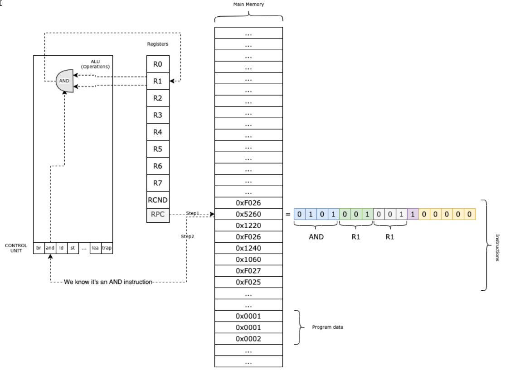
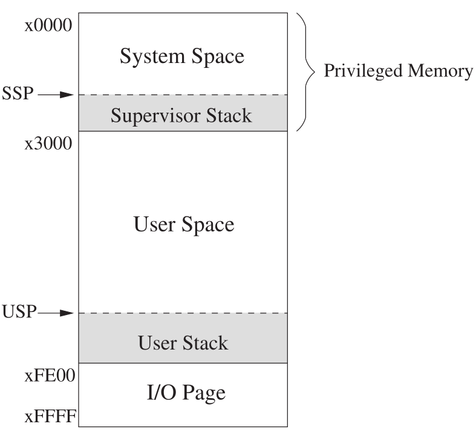

# Objectives

In this assignment you will continue our work on the LC-3 ISA simulator
that we started previously, and continue practicing C.  Previously
we implemented most of the 16-bit LC-3 microarchitecture.  In this
assignment we will add onto the LC-3 simulator the mechaisms to
support some of the OS-level features defined for the LC-3 computer
architecture.

In particular, in this assignment you will get an example of one
way that hooks for invoking system calls can be created for an
OS to run on time of the ISA/microarchitecture.  In this assignment
you will implement the trap call/return mechanism.  This will require
us to add in priority and privilege level mechanisms to the
simulated computer architecture.  In essence, you will implement
a supervisor/user mode, and the mechanisms that switch between these
when a trap, exception or interupt happens.

We will also implement some basic memory mapped I/O in this assignment,
so that we can provide keyboard input and display character output on
a terminal from the LC-3 simulator.  You will use the memory mapped
I/O to create and test basic service routines to get and display
character I/O from the trap service routines.


**Questions**

- How are privilege and priority levels defined and implemented
  in a simple computer architecture?
- What is the relationship between a trap, an exception and an
  interrupt?
- How are system calls implemented by computer architectures to
  allow for an operating system to implement additional levels
  of abstraction for a computer?
- What are typical mechanisms to implement memory mapped
  I/O operations in a computing system?
- How are access to I/O devices provided as higher level abstractions
  by operating system service routines?

**Objectives**

- Become more familiar with the LC-3 ISA definition.
- See an implementation of operating system level
  abstractions in a simple LC-3 ISA simulation.
- Understand how privilege works in the OS level and its use and
  relationship to os system calls.
- Understand how basic memory mapped I/O functions in a simple
  computer architecture.
- Learn about system level C functions useful in implementing
  procedures at this level of a machine description.


# Description

In this assignment you will be extending the previous implementation
of the LC-3 microarchitecture simulation to add in several OS-level
computer architecture concepts and mechanisms.  You have been given
a working implementation of our previous microarchitecture
assignment as a starting point, though feel free to use or compare
with your previous assignment implementation while adding in
the OS-level mechanisms for this assignment.

# Overview and Setup

For this assignment you will be adding in additional functions
and declarations for the `lc3vm.cpp` simulation.  As usual
before starting the assignment tasks proper, you should make
sure that you have completed the following setup steps:

1. Accept the assignment and copy the assignment repository on GitHub
   using the provided assignment invitation link for 'Assignment 05:
   LC-3 OS Level Mechanisms' for our current class semester and
   section.
2. Clone the repository using the SSH URL to your host file system
   in VSCode.  Open up this folder in a Development Container to access
   and use the build system and development tools.
4. Confirm that the project builds and runs, though no tests will be
   defined or run initially.  If the project does not build on the first
   checkout, please inform the instructor.  Confirm that you C/C++
   Intellisense extension is working, and that your code is being
   formatted according to class style standards when files are saved.
5. You should create the issue for Task 1 and/or for all tasks for the assignment
   now before beginning the first task.  On your GitHub account, go to `Issues`,
   and create them from the issue templates for the assignment.  Also make
   sure you are linking each issue you create with the `Feedback`
   pull request for the assignment.

# Assignment Tasks

The starting state for this assignment has implementations of the
simulated LC-3 microarchitecture functions to implement the basic
fetch-decode-execute cycle for the LC-3. The basic outline of the simulator functions
like this at this point:

- We load 1 LC-3 machine language (binary) program into the (simulated) main
  memory.
- In the RPC register, we keep the program counter, the next instructions to fetch,
  decode and execute.
- The instruction is fetched and the **Operation Code** (first 4 bits) is obtained
  from this instruction.  Based on that, we decode the rest of the address and
  control bits from the fetched instruction.
- We execute the method associated with the given instruction, using a function lookup
  table.
- We increment the RPC for normal sequential execution and continue with the next
  fetch-decode-execute cycle.



## Task 1: Processor Status Register PSR Privilege and Priority

## Task 1 Part 1: PSR Privilege Mode Bit
For task 1 we are going to add in additional meaning to the Processor Status
Register (PSR).  Previously we had only made use of the low 3 bits of the
PSR to hold the N,Z,P condition codes.  In order to implement traps,
exceptions and interrupts, we need to add in a supervisor/user
privilege mode distinction to the computer architecture, and
a notion of priority level for interrupts.  The bits we will use
in the PSR look like the following:


Recall that we already define `reg[PSR]` to hold the current process status
register bits, and there is a macro named `RCND` which masks the low
3 bits so that we can test if the N, Z or P flags are set easily.

As usual start by defining `task1_1`.  We have broken up the first
task into 2 parts.  For the first part you need to implement a few
methods to set and test the privilege mode bit of the PSR.  To simplify
the implementation, it is better to define all of the following as regular
C functions, rather than using C macros.

When bit 15 of the PSR is a 0 the machine is in supvisor mode (the more
privileged mode used by the OS). When bit 15 is 1 we are in user mode.  
You should see from the tests for task 1 part 1 that we start by setting
all of the bits of the PSR to 0, thus we are initially in supervisor mode.

You need to write 3 functions to get the task 1 part 1 tests to pass.  You need
to declare each function in the `lc3vm.h` header file, and put the
implementation into `lc3vm.c`.

1. The `is_user_mode()` function should return a `bool` result.  It needs
   to test bit 15 and return `true` if the bit is 1 indicating running in
   user mode, and return `false` if it is 1 indicating currently in
   supervisor mode.  You need to use masks here as the NZP and priority
   level bits may not always all be 0.
2. `user_mode()` is a `void` function.  It should set the bit 15 of the
   PSR to be 1, leaving all of the other bits unchanged.  The tests
   start by switching into user mode by calling this function.
3. `supervisor_mode()` is also a `void` function that puts the machine
   into supervisor mode by setting bit 15 to 0.

Once you implement these 3 functions they should successfully pass the tests 
given for part 1 of task 1.

## Task 1 Part 2: PSR Priority Level Bits

Bits 10-8 of the PSR keep track of the priority level that the machine
is currently running at.  Priority levels are mainly used for the interrupt
handling mechanisms in computer architectures.  Since 3 bits are used
for the priority level, this means 8 level of priority from 000 (0)
to 111 (7) are possible in the LC-3 machine.

**NOTE:** Read Patt and Patel Chapter 9.1 for details on the privilege and priority
level mechanisms.

Define the `task1_2` tests and implement the following

1. `priority()` returns the current priority level set in the PSR
   priority bits.  This should return an `uint16_t` type.
2. `set_priority()` is used to set the priority bits.  Again pass in
   a `uint16_t` type for the parameter, though we only use the least
   significant 3 bits of this parameter value.

These function may be a bit tricker than the previous ones, especially
`set_priority()`, since you are working with 3 bits for the priority level.
For `set_priority()` one approach is to first 0 out the PSR[10:8] bits, so that
you can then shift up the passed in parameter and or (|) it with the
PSR in order to set the needed priority level bits.

The tests for `task1` test no only that you set or get the
appropriate bits, but also that you are not modifying bits that should
not be changed in the PSR when you change the privilege or
priority levels.

Once you have all of the tests passing for parts 1 and 2 of task 1, 
create a commit and push it to your GitHub classroom repository.

# Task 2: Stack push/pop for trap/exception mechanism

**Note**: Read Patt & Patel section 9.1.2 on the LC-3 Organization of Memory and
appendix A.2 and A.3 for descriptions of the trap, interrupt and exception
processing mechanisms.

With the addition of a user/supervisor privilege mode mechanism, we can
begin to add in other needed mechanisms so that an operating system can
manage a computing system and allow user programs to run on the system and
make higher level services available for use by user programs.

Recall that the LC-3 computer uses a 16-bit memory address space.  The
layout of LC-3 memory looks like the following:



The space from 0x3000 to 0xFE00 is user space.  Programs that run in regular
user mode are loaded into user space.  System space is defined from
0x000 to 0x2FFF in memory.  This is where the operating system loads its
programs.  In order to run code that is in the system space privileged memory, the machine
must be in supervisor mode.

Notice that at the bottom of system and user space stacks are defined.  We will need
to add in two additional registers in a later task to our LC-3 register declarations, the `SSP` and `USP`
which will hold the top of the System Stack Pointer (SSP) and the User Stack Pointer
(USP) respectively.  Initially USP is initialized to xFE00 and SSP is initialized to
0x3000.

The stacks are used for jumping into and returning from subroutines (JSR,JSRR/RET) and
for invoking traps, exceptions and interrupts.

By convention in the LC-3 machine, `R6` is treated specially.  This register holds
the memory address of the top of the current stack being used.  The `SSP` and `USP`
we mentioned are used when a mode switch from user to supervisor mode or back occurs.
For example when we switch from user mode into supervisor mode, `R6` should have
the stack pointer for the current user stack.  We save `R6` in the `USP` and then
load the `SSP` into `R6` when we switch to supervisor mode, so that now we are pushing
and popping onot the supervisor stack.  The reverse occurs when we mode switch
from supervisor mode back to user mode.

For this task, we first want to implement convenience methods that manipulate 
`R6` for pushing and popping values on and off whichever stack it is pointing
to.

In the figure showing the LC-3 memory layout, the smallest address 0x0000 is at the
top and goes down to the largest address 0xFFFF at the bottom.  By convention, `R6`
holds the memory address of the top of the current stack, and when we push
values onto the stack, the address needs to be subtracted by 1 when growing the stack,
and when we pop a value the stack needs to have 1 added to shrink the stack.

Define the `task2` tests and implement the push and pop microarchitecture
methods that will be used to manipulate the supervisor and user stacks through
the `R6` register.  Do the following:

1. Implement `push()`, which will take an `uint16_t` value as its input parameter (and it is a `void` function).
   This method assumes that `R6` is pointing to the top of the current stack in use.
   Subtract 1 from the stack address in R6 to grow the stack, and then place the
   parameter that was pushed into memory that is now pointed to as the top of the
   stack by `R6`.  You are required to reuse the `mem_write()` function here, as
   we later need to add in checks that we are not accessing privileged memory
   when in user mode.
2. You also need to implement `pop()` which takes no parameters and is also a
   `void` function.  This function should pop off the value from the top of the stack.
   To do this you simply need to add 1 to the current value of the `R6` register holding
   the current stack pointer.

# Task 3: Master Control Register (MCR) and halting execution

**Note**: Read Patt & Patel section 9.3 on OS Service Routines, in particular we
first start here with section 9.3.7 to add in the RUN latch of the MCR

Recall that in our first implementation of the LC-3 virtual machine we had simply
defined a global `running` boolean variable that the halt trap service routine set
to `false` in order to cleanly stop the fetch-decode-execute cycle.  Years
agao many ISAs had a separate HALT instruction, but this was very rarely
executed so seemed wasteful to use an entire opcode for it.  In modern machines a 
RUN latch, or clock enable bit, is memory mapped to an address in the computer, and any system
service routine can halt the execution of the computer by clearing
a particuar bit that controls the RUN latch.  In LC-3 the RUN latch bit is
bit [15] of the Master Control Register, which is memory mapped to
location 0xFFFE.  

**Note**: See Patt & Patel Table A.1 for the device register memory mapping assignments.

We are going to simulate the memory mapped MCR and manipulating its bit [15]
to control the clock enable/disable of our machine.

**Note**: You should look at the changes made to the definition of the `reg[]`
array.  Notice it is now a pointer and we declare it in `lc3vm.c` like this:

```
// memory map the registers starting at address 0xFFF0, maps PSR to 0xFFFC and MCR to 0xFFFE
// uint16_t reg[RCNT] = {0};
uint16_t* reg = &mem[0xFFF0];
```

So really all of the registers are mapped into memory addresses starting at address
0xFFF0.  This includes that the PSR processor status register is actually mapped
to address 0xFFFC and that the MCR machine control register we are about to use
is mapped to address 0xFFFE as specified in the LC-3 architecture.

Implement the following functions to test and set the MCR clock enable bit:

1. `enable_clock()` is a `void` function that takes no parameters.  This
   function should simply set the MCR bit [15] to 1 in order to enable the
   system run latch.  You are required to use the `reg[]` mapping to access
   MCR from this function.
2. `disable_clock()` is also a `void` function with no parameters, and it
  should do the opposite and set the MCR bit [15] to 0.
3. `is_running()` is a function that returns a `bool` result by testing
  the MCR run latch bit [15].  It should return `true` if the clock is
  currently enabled and thus the system is running, and `false` if not.
  We will later be using this function to control the fetch-decode-execute
  loop termination.

Once you are passing all of the task 3 tests and are satisfied with your
implementation, make sure you create a commit for task3 and push your work
to your GitHub classroom repository.


# Task 4: `trap()` and `rti()` opcode implementations

**Note**: Read Patt & Patel section 9.3 for information about OS
system service routines in LC-3 using traps.  But also read the
appendix A.2 details of the `trap` and `rti` instructions for details
on how these need to be implemented.

## Task 4 Part 1: (re)Implement `trap()` microarchitecture opcode

The `trap` instruction in LC-3 is how we allow user programs
to invoke system / service calls implemented by the operating
system.  In particular a `trap` will first cause the computer
to switch to supervisor mode if we are currently in user mode, and
it will then be able to run a trap service routine provided by
the operating system in the privileged mode.

If you look at the code given for this assignment, the implementation
we had given for traps previously has been removed, and the `trap()`
and `rti()` functions are currently empty functions.  We need
to reimplement traps using the new privilege level modes and functions.

The pseudocode given in A.2 for the `trap` instruction is as follows:

```
TEMP = PSR;
if (PSR[15] == 1) // e.g. if currently in user mode
    USP = R6 and R6 = SSP 
    PSR[15] = 0 // change to supervisor mode now
push PC
push TEMP // push PC and the original PSR on stack
PC = mem[ZEXT(trapvect8)];
```

In English, when a `trap` occurs, if we are currently running in user mode, we
save the current value in `R6` which has the current user stack pointer, and
we restore the system stack pointer into R6.  Once this is done we set
the MCR bit [15] to 0 so we are now running code as supervisor.  Notice
that the switch of the stack pointers only needs to be done when we
mode switch from user into supervisor mode.  Weather we switch mode or
were already in supervisor mode, we need to push the `PSR` (before we
possibly modified the `PSR` privilege bit) and the current `RPC` onto our
stack, which since we are guaranteed to now be in supervisor mode should
be pushed onto the supervisor stack.

Finally what the `trap` really is doing is calling a trap procedure.
We need to save the current `PSR` and `RPC` on the stack so that if/when
an `rti` instruction executes to return from the trap/interrupt, we can
restore the processor status and the PC to continue executing from where
the trap was invoked.  So the last statement modifies the PC to change
executing to the invoked trap service routine.  The low 8 bits [7-0]
of the `trap` instruction are really an index into the trap service
routine table.  The trap service routine table is loaded into memory
addresses 0x0000 - 0x00FF.  So the LC-3 architecture can support up to 
256 trap service routines as operating system service calls.

The trap service table in addresses 0x0000 - 0x00FF is really only
a lookup table of addresses to the location of the service routine.
The operating system will usually load the service calls that it
defines into protected memory, and set up the trap service routine
mechanism so they can be invoked using the `trap` instruction with
an appropriate `trapvect8` code.

Define the `task4_1` tests and implement the `trap()` function to 
pass the given tests.  You need to implement the pseudo code given
above for the `trap` instruction.  Recall that the instruction is
passed in as a parameter to this function (the declaration of `trap()` and
the empty function should already be in the file for you for this task).

Some hints about the implementation:

- You are required to reuse the `is_user_mode()` and `supervisor_mode()`
  functions to test and switch from user mode to supervisor mode.
- Likewise you need to use the `push()` method to push on the PSR and the
  PC to the system stack.
- You are required to push the PC first then the original PSR, so that
  the PSR ends up on top of stack, and the return PC below it.
- As shown in the pseudocode, you need to save the PSR before
  switching to supervisor mode, the PSR that is pushed on needs to be
  what it was when the function is called.
- There is a `TRP` macro defined in `lc3vm.h` that you can and should use
  to extract the low 8 trap vector bits from the instruction.
- You are required to use `read_memory()` here to look up the trap
  service routine address in memory using the `trapvect8` bits of the
  instruction.


You should notice in the tests that the `ld_img()` function is used to
load an assembled LC-3 image into memory before the tests.  This contains
the address of the trap service routines used in this set of tests.
You might want to look at the `progs/trap-vector-table.asm` file to get
an idea of how this image code is created and assembled.

Complete the `trap()` implementation to pass the given tests before moving
on to part to to implement the corresponding return from interrupt/trap
instruction.

## Task 4 Part 2: (re)Implement `rti()` microarchitecture opcode

The `rti()` instruction is the logical inverse of invoking a
service call using trap.  Note that `rti` is a mnemonic for 
"return from trap or interrupt.  The interrupt service routines
have basically the same mechanism in LC-3, and we can return from
an interrupt or trap service routine using this opcode.

The pseudocode given for `rti` in appendix A.2 of the Patt and Patel book is:

```
if (PSR[15] == 1) // if we are in user mode you can invoke rti
  Initiate a privilege mode exception

PSR = mem[R6]   // R6 is the SSP, the PSR is restored
pop
PC = mem[R6]    // R6 is the SSP, PC is restored
pop      

if (PSR[15] == 1) // we did a mode switch back to user mode
   SSP = R6 and R6 = USP
```

We will later in the assignment add in exceptions, so you don't have to
handle generating an exception if `rti` is called while in user mode.

Otherwise the `rti` instruction is relatively simple, you pop off
and restore the `PSR` and `RPC` from the system stack.  When you
restore the `PSR` you may be restoring back to user mode
privilege status, indicating you are returning back to userland
from a user invocation of a trap.  In that case you need to 
save the system stack pointer and then restore
back the saved user stack pointer to R6.

- You are again required to use the `pop()` methods to manipulate
  the system stack.
- And you should be using `mem_read()` to read the `PSR` and `RPC`
  values when restoring them from the stack.

Implement the `rti()` function to pass the given unit tests. Once you are
passing your tests for `trap` and `rti` instructions, create a commit
and push your work back to your GitHub classroom reopsitory.

# Task 5: halt trap Clock Disable

So far we have added in the `MCR` machine control register bit to
enable and disable the simulated system clock, and a working `trap`
invocation and return mechanism.  We are ready to begin adding in
functionality for the LC-3 simulator and prepare to implement
memory mapped I/O.  Before we move on, lets modify the existing
`start()` function, that implements the basic fetch-decode-execute
cycle, to use the new run latch control bit.

Enable the `task5` tests, and modify the `start()` method to use
the new `is_running()` method that is testing the MCR clock
enable bit.  The `task5` tests load the trap vector table
again and a simple `halt` trap service routine.  Examine the
file named `progs/task5-halt-trap.lc3`.  When invoked this
service routine will set the run latch bit to 0.  So if you modify
the main `start()` loop to be testing this bit, it should successfully
terminate the call to `start()` in the test for this task.  If you
don't have this working properly,  your tests might enter into an
infinite loop.

- You are required to reuse your `is_running()` method in the
  `start()` function to test the clock run latch.

Once you are able to pass the tests for this task, create a commit
and push your work to your GitHub classroom repository.

# Task 6: KBSR and DSR I/O Status Updates on Memory Access

**Note**: consult Pat & Patel chapter 9.2 for more details about 
I/O in LC-3 and how memory mapped I/O functions.  Also Figure A.1
again for memory layout and Table A.1 for the device register assignments.

We are now going to add in memory mapped I/O functionality for
a (simulated) keyboard input device and a (simulated) output
display device.  As we saw earlier in the figure of the memory
layout for LC-3, addresses in the range from 0xFE00 thorough 
0xFFFF are reserved for device register mapping addresses.  We have
been using registers and the PSR and MCR that have been mapped
into this address space.  

If you look in `lc3vm.h` and `lc3vm.c` there is also defined
an `iomap[]` array that maps to the I/O device range of memory.
The Table A.1 for device register assignments is shown here:


You can access the device mappings using the array and defined
enumerated type, for example to get the keyboard status register
do `iomap[KBSR]`.  There are also some defined constants of the
actual memory address of the device registers, for example
`KBSR_ADDR` is the keyboard status register address 0xFE00.

We will start adding support for the I/O devices but hardcoding
the needed updates of the memory mapped status registers on
a read or a write of the device.

## Task 6 Part 1: Update KBSR when KBDR is read

The way that memory mapped polling works is that the
high bit [15] in the status register is used to
signal when the device is ready.  For the Keyboard
device, the KBSR bit [15] should be set to 1 when
a character is read and waiting in the KBDR.  This
will happen later as part of the fetch-execute-decode
cycle where we will check for input.  But the
KBSR bit [15] needs to be cleared to 0 whenever
the KBDR memory address is read by some program.

So add the following logic to the `mem_read()`
function:

```
if address is KBDR_ADDR
    clear KBSR[15]
```

Of course you should do this before returning the value
that is read from memory.  The following are requirements

- You need to test the address against the `KBDR_ADDR` to see if
  the bit should be cleared
- But you should be using the `iomap[KBSR]` when manipulating
  and clearing the keyboard status bit.
- Make sure you do this before reading and returning the asked
  for value.

Once you can successfully clear the KBSR bit on a read of
the KBDR, continue on to the second part of the task.

## Task 6 Part 2: Update DSR when DDR is written

Likewise for the display device, we will hardcode in the
basic fetch-decode-execute cycle to see if the DSR is 0,
meaning that there is a character in DDR that should be
displayed on the display device.  The LC-3 supervisor
programs will then display characters by writing a character
into the DDR.  So on a write to the DDR we need to again
clear the DSR to 0.  This signals that the display hardware
needs to display the character, and once that is done it
will set the DSR back to 1 in the fetch-decode-execute cycle.

So add the following logic to the `mem_write()`
function:

```
if address is DDR_ADDR
    clear DSR[15]
```

Keep in mind the following

- As hinted at again you should be using the defined `DDR_ADDR`
  when testing if the display data register is receiving a new
  character.
- And also use `iomap[DSR]` to manipulate and clear the display
  status register bit.

Once your implementation is satisfactory and passing the tests for both
parts, make a commit of your task 6 work and push it back to your
GitHub classroom repository.

# Task 7: Exception Handling

**Note**: See Pat & Patel section A.3.2 for details on exceptions in the
LC-3 architecture and handling exceptions.

There are 3 exceptions defined in the LC-3 ISA: illegal opcode, privilege mode
violation and access control violation (ACV).

The illegal opcode exception is generated if the unused reserved opcode
(bits [15:12] = 1101) attempts to be executed.

A privilege mode violation occurs if an instruction that can only be used
in supervisor (privileged) mode is attempted while running in regular
user mode.  For LC-3 the `RTI` instruction is the only one that is reserved
completely for supervisor mode execution, to return from an interrupt, exception
or trap service routine.  The reason for this is that the `RTI` might cause
a mode switch back to user mode, and in general userland code cannot run
service routines that need to change back to user mode.

An access control violation (ACV) occurs if an attempt is made to read
or write privileged memory space while the machine is in regular user
mode.  As indicated in previous drawings of the memory layout for the LC-3
architecture, all addresses from 0x0000 through 0x2FFF are privileged
address.  But also, not really indicated in the figures, but all memory
mapped I/O and register addresses are also considered privileged memory, the
address space from 0xFE00 up to 0xFFFF.

The handling of an exception works similarly to how a trap (and also
an interrupt) is handled.  One difference is that exceptions and
interrupts are hardware device generated, while a trap is software
generated by user programs.  So the LC-3 microarchitectures
will generate exceptions when needed, but our implementation in our
simulation will be very similar to the `trap()` instruction
function.

The exception supplies an eight-bit vector, like the trap vector.
The exception vector table resides at addresses in memory starting
at 0x0100, just above the trap vector table.  The following three
exceptions are hardcoded in the LC-3 specification:

| Vector | Address | Exception                      |
|--------|---------|--------------------------------|
| 0x00   | 0x0100  | privilege mode violation       |
| 0x01   | 0x0101  | illegal opcode exception       |
| 0x02   | 0x0102  | access control violation (ACV) |

# Task 7 Part 1: `except()` microarchitecture method

Start by copying the declaration and implementation of the
`trap()` instruction function, and renaming the copy
`except()`.  The only modifications you need to make,
besides changing the name and updating the function
documentation, is that the exception vector
needs to be looked at from an offset of 0x0100, so you need
to add that to the exception vector passed in to this function
to look up the location of the exception handling routine.
You can reuse the `TRP` macro to extract the 8 bits, but simply
add the needed offset to this vector.

Once you enable `task8_1` tests and add the `except()`
method, it will load an exception table and test that your
function is still correctly changing to supervisor mode
and manipulating `R6` and the stack when an exception is
invoked.  Once the part 1 test for this task are passing,
move on to the next parts to add in calls to generate
the exceptions where needed.

# Task 7 Part 2: Privilege Mode exception

When implementing the `rti()` instruction, there
was a mention in the pseudocode that if we are
currently in user mode that an exception should be
thrown.  Add in the test at the beginning of the
`rti()` instruction function that will check if
we are in user mode, and if so will call `except()`
to generate a privilege mode violation (except vector 0x01).

**NOTE**: You can't continue on after calling the
`except()` here, you need to return and not
finish the rest of the `rti()` instruction on the
privilege mode exception.

Enable the task8_2 tests once you have added this to see
if invoking `RTI` instruction while in user mode
causes the exception.

# Task 7 Part 3: Illegal opcode exception

Similarly if an attempt to execute the reserve opcode
happens, this exception should be generated by the
(simulated) hardware.  Add in the appropriate call
to the `res()` microarchitecture function to throw
an illegal opcode exception.  Then enable the
`task7_3` tests and check that it is thrown if
an attempt is made to execute the reserved opcode.

# Task 7 Part 4: Access Control Violation (ACV)

Finally we will implement basic memory protection.
We want to protect any read or write access to privileged
memory when the machine is currently in user mode.  So add
in checks to both `mem_read()` and `mem_write()`.  If
the machine is currently in user mode, and the address is
in the privileged address space (0x0000 - 0x2FFF  system space
or from 0xFE00 to 0xFFFF for privileged device register
addresses).  To simplify you can test if the address is
either below 0x3000 or above 0xFDFF.

Add in these tests to `mem_read()` and `mem_write()`.
In both cases the operation should not be performed,
e.g. `mem_write()` should not cause a change in privileged
memory to occur, and `mem_read()` should just return
a 0x0 value.  The access control violation ACV exception
should be invoked for these cases and the function should
return without writing or return 0x0 after the exception
call.  Note this should also happen before any test/updates
of the device status registers occurs as well.

Enable the `task7_4` tests once you have implemented the
checks for access control violations.  Once all tests for
task 7 are passing, make a commit of your task 7 work and
push the work to your GitHub classroom repository.

# System Tests: Testing and Running the LC-3 Simulator

For this assignment, the final 10 points are given for having
all of the system tests passing successfully.  There is one line
of code that was commented out in the `start()` function, that
calls `check_device_status()`.  We commented this out
when developing tasks 1-7 so that it would not interfere with
the development of the tasks.  We had also commented out calls
to the `enable_clock()` and `user_mode()` functions in the
`init()` initialization method, but you should have enabled
those as described before performing the task 5 to enable and
test the hat trap mechanisms.

But still it is easy to have some small mistakes in your
implementations of tasks that, while they pass the unit tests,
will not completely work when performing full system tests
where we load an LC-3 program and run it.  Uncomment the
final call to the `check_device_status()` and try running
the given system tests.

You can run the system tests by opening a terminal and doing a

```
$ make system-tests
```

Which will invoke a script that loads several test programs, executes them and then
checks their results.  If all of your system tests are passing, then your
implementations are probably good and you can make a final commit of your
code and push it to your GitHub classroom repository.  If not all tests
are passing, you will need to do some further investigation and
debugging of your work.

Whether your tests pass or not, it is worthwhile to take a look at the
code that is run for the system tests.  For example, you can run
the `prog-04` test like this:

```
$ ./lc3vm progs/prog-04.exe
```

The `prog-*.exe` files in the `progs` subdirectory contain linked together
images.  You should examine all of the `.lc3` assembly files in this
subdirectory and understand what is being done here.  The LC-3 assembly
files define the `trap-vector-table.lc3` and the `exception-vector-table.lc3`
which simply fill in hooks to the trap and exception system service
calls provided by our primititive LC-3 architecture OS.  You will
find implementations of the traps in the `trap-*.lc3` files, and of the
exceptions in the `exception-*.lc3` assembly files.  

For example, if you tried running `prog-04.exe` by hand, examine the
`prog-04.lc3` assembly file to see what it does.  It simply invokes
`trap 0x23` 3 times, in order to call the `trap-in.lc3` trap system
service routine.  This routine writes a prompt to the display device
and reads in a single character.  The `prog-04.lc3` ends by
invoking `trap 0x25` to call the `trap-halt.lc3` service routine.
All-in-all the `prog-04` is testing the IN trap service routine, which
uses the keyboard I/O memory input mechanisms of our LC-3 machine.  And
all of the routines send output to the display device, testing the
memory mapped output mechanisms.  The `prog-01.lc3`, `prog-02.lc3`
and `prog-03.lc3` programs simply cause each of the 3 different
exceptions to happen, in order to test the exception handling 
mechanisms.

Please do run the programs by hand and make sure you understand how they
work.  If any of the tests are not passing once you uncomment the
final code in the `start()` function, you will need to debug the
execution of the LC-3 vm simulator to try and determine where the
issue lies in your implementation.

# Assignment Submission

For this class, the submission process is to correctly create pull
request(s) with changes committed and pushed to your copied repository
for grading and evaluation.  For the assignments, you may not be able
to complete all tasks and have all of the tests successfully
finishing.  This is ok.  However, you should endeavor to have as many
of the tasks completed before the deadline for the assignment as
possible.  Also, try and make sure that you only push commits that are
building and able to run the tests.  You may loose points for pushing
a broken build, especially if the last build you submit is not
properly compiling and running the tests.


In this problem, up to 25 points will be given for having at least 1
commit that compiles and runs the tests (and at least some attempt was
made to work on the first task).  Thereafter 5 to 10 points are awarded for
completing each of the remaining 6tasks.  However you should note that the
autograder awards either all point for passing all tests, or no points
if any test is failing for one of the tasks.  Also note that even if
you pass all tests, when the instructor evaluates your assignment,
they may remove points if you don't follow the requirements for
implementing the code (e.g. must reuse functions here as described,
need to correctly declare parameters or member functions as `const`
where needed, must have function documentation correct).  You may also
loose points for style issues.  The instructor may give back comments
in pull requests and/or create new issues for you if you have issues
such as these, so it is good to have work committed early before the
due date, so that the instructor may give feedback requesting you to
fix issues with your current submission.


# Requirements and Grading Rubrics

## Program Execution, Output and Functional Requirements

1. Your program must compile, run and produce some sort of output to be
   graded.  0 if not satisfied.
2. 40 points for keeping code that compiles and runs.  A minimum of 50 points
   will be given if at least the first task is completed and passing tests.
3. 5 to 10 points are awarded for completing each subsequent task 2-10.
4. +5 bonus pts if all system tests pass and your process simulator produces
   correct output for the given system tests.

## Program Style and Documentation

This section is supplemental for the first assignment.  If you uses
the VS Code editor as described for this class, part of the
configuration is to automatically run the `clang-format` code style
checker/formatter on your code files every time you save the file.  You
can run this tool manually from the command line as follows:

```
$ make format
clang-format -i include/*.hpp src/*.cpp
```

Class style guidelines have been defined for this class.  The `uncrustify.cfg`
file defines a particular code style, like indentation, where to place
opening and closing braces, whitespace around operators, etc.  By running the
beautifier on your files it reformats your code to conform to the defined
class style guidelines.  The beautifier may not be able to fix all style
issues, so I might give comments to you about style issues to fix after looking
at your code.  But you should pay attention to the formatting of the code
style defined by this configuration file.

Another required element for class style is that code must be properly
documented.  Most importantly, all functions and class member functions
must have function documentation proceeding the function.  These have been
given to you for the first assignment, but you may need to provide these
for future assignment.  For example, the code documentation block for the first
function you write for this assignment looks like this:

```c++
/**
 * @brief initialize memory
 *
 * Initialize the contents of memory.  Allocate array larget enough to
 * hold memory contents for the program.  Record base and bounds
 * address for memory address translation.  This memory function
 * dynamically allocates enough memory to hold the addresses for the
 * indicated begin and end memory ranges.
 *
 * @param memoryBaseAddress The int value for the base or beginning
 *   address of the simulated memory address space for this
 *   simulation.
 * @param memoryBoundsAddress The int value for the bounding address,
 *   e.g. the maximum or upper valid address of the simulated memory
 *   address space for this simulation.
 *
 * @exception Throws SimulatorException if
 *   address space is invalid.  Currently we support only 4 digit
 *   opcodes XYYY, where the 3 digit YYY specifies a reference
 *   address.  Thus we can only address memory from 000 - 999
 *   given the limits of the expected opcode format.
 */
 ```
This is an example of a `doxygen` formatted code documentation comment.
The two `**` starting the block comment are required for `doxygen` to
recognize this as a documentation comment.  The `@brief`, `@param`,
`@exception` etc. tags are used by `doxygen` to build reference
documentation from your code.  You can build the documentation using the
`make docs` build target, though it does require you to have `doxygen`
tools installed on your system to work.

```
$ make refdocs
Generating doxygen documentation...
doxygen config/Doxyfile 2>&1 | grep -A 1 warning | egrep -v "assg.*\.md" | grep -v "Found unknown command" | grep -v "Searching for include" | sed -e "s|/home/dash/repos/assg01/||g"
Doxygen version used: 1.9.1
```

The result of this is two new subdirectories in your current directory named
`html` and `latex`.  You can use a regular browser to browse the html based
documentation in the `html` directory.  You will need `latex` tools installed
to build the `pdf` reference manual in the `latex` directory.

You can use the `make refdocs` to see if you are missing any required
function documentation or tags in your documentation.  For example, if you
remove one of the `@param` tags from the above function documentation, and
run the docs, you would see

```
$ make refdocs
doxygen config/Doxyfile 2>&1 | grep -A 1 warning | egrep -v "assg.*\.md" | grep -v "Found unknown command" | grep -v "Searching for include" | sed -e "s|/home/dash/repos/assg01/||g"

HypotheticalMachineSimulator.hpp:88: warning: The following parameter of
HypotheticalMachineSimulator::initializeMemory(int memoryBaseAddress,
    int memoryBoundsAddress) is not documented:
  parameter 'memoryBoundsAddress'

```

The documentation generator expects that there is a description, and that
all input parameters and return values are documented for all functions,
among other things.  You can run the documentation generation to see if you
are missing any required documentation in you project files.
